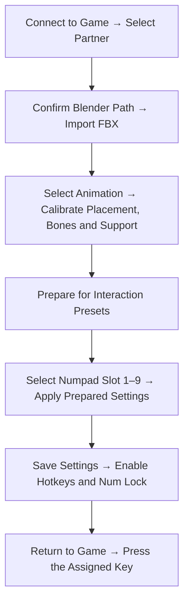

# EndfieldAnimationImporter User Guide

[繁體中文](README.md) | English

Version: **1.0.4-Alpha** · Windows x64 · October 7, 2026

The module appears in BEM as **EndfieldAnimationImporter**. Its in-game panel is **EAI Panel (Num0)**. This is an Alpha release; read the compatibility notes before use.

## Introduction

EAI is a third-party module loaded through [Better Endfield (BEM)](https://github.com/Dr-hydra/Better-Endfield). Install BEM before downloading and using this module.

EAI retargets humanoid FBX animations to a partner character in your party. It provides in-game preview, character placement, bone adjustment, timeline seeking, animation clipping and numpad interaction presets. It recognizes the currently controlled male or female Endministrator and records that choice in presets.

Single-character FBX animations can optionally use experimental procedural Endministrator poses. The external-model page supports EFMI mod scanning, parameter bridges and mesh transforms that require reloading. Live GPU mesh adjustment is unfinished.

## 1. Before You Start

| Requirement | Details |
| --- | --- |
| Runtime | Windows x64, the game, and a BEM version capable of loading this module |
| FBX conversion | Install Blender locally; Blender is not included |
| Animation JSON | Use EAI animation JSON. Playback does not require running Blender again |
| Controlled character | Male or female Endministrator |
| Partner | Must be in the party, with its model instantiated by the game |
| External models | Install EFMI and the desired appearance mods separately |

**Disable BEM's camera module and restart the game.** Turning off first-person view alone can leave the camera hook occupied and prevent connection. Simultaneous use with that camera module is not supported.

BEM and EFMI can run together. For external-model features, select **XInput auto-start** in BEM. EAI does not include EFMI, third-party appearance mods or your animation files.

### Install or Update

1. Close the game. Import the module ZIP through BEM and enable it.
2. Disable BEM's camera module and restart the game.
3. Control an Endministrator and enter normal gameplay.
4. Press **Num0** to open the panel.
5. Under **Module Settings → Partner**, select **Connect to Game**.
6. Refresh the party and select the partner.

Back up the data directory listed below before updating if needed. EAI and BEM have separate version numbers; compatibility with every game or BEM version is not guaranteed.

## Quick Start



## 2. Panel, Language and Hotkeys

Use the language menu at the **far left** of the panel to select **繁體中文** or **English**. Labels update immediately. The native panel and BEM web page remember their language choices independently. Language changes do not modify saved animation IDs, bone names or preset parameters.

| Key / Page | Purpose |
| --- | --- |
| Num0 | Open or close the in-game panel |
| Esc | Return to the game while editing the panel |
| Mouse wheel | Scroll; use section arrows to collapse or expand content |
| Numpad 1–9 | Activate configured presets; enable hotkeys and Num Lock |
| Animation Import | Blender path, Endministrator pose, FBX / animation JSON import and library |
| Module Settings | Characters, calibration, timeline, bones and presets |
| External Models | EFMI scanning and bridge controls |

For hotkey playback, **press the same key to stop**. Pressing another configured key stops the current animation and switches to that preset. Empty or disabled slots do nothing. If a character requirement is not met, follow the prompt to change the controlled Endministrator or partner.

BEM's module web page also provides controls. Its FBX picker, Blender folder picker and clip Save As controls open native dialogs. If a dialog is unavailable, open the Num0 panel in-game first.

## 3. Import an FBX

For the first test, use normally standing characters, select **None** for the Endministrator pose and **Free** support. This makes the source animation easier to assess.

1. Stop the current animation and select the intended partner.
2. Open **Animation Import**.
3. Check **Current path** for Blender's installation folder.
4. If Blender was not found, select **Choose Blender Folder** and choose a folder containing `blender.exe`. Its parent Blender Foundation folder can also be used. Valid selections are saved.
5. Select **Endministrator Pose (Experimental)**.
6. Select **Import FBX**, choose the file and wait for conversion to finish. Keep the character and playback state unchanged during conversion.
7. Open **Module Settings → Calibration** and select the generated animation.

Blender runs in the background. You do not need to operate it manually or send the FBX to the developer for conversion. Initial import still needs the target character's skeleton reference from the running game.

### Endministrator Pose (Experimental)

| Option | Effect |
| --- | --- |
| None | Apply only the partner's FBX animation |
| Standing | Preserve the Endministrator's initial standing bone rotations |
| Front Waist Hug | Both hands approach the partner's waist from the front |
| Back Waist Hug | Both hands approach the waist from behind |
| Head Pat (Both Hands) | Both hands approach the partner's head |

These are procedural tracking poses, not a two-character animation contained in the source FBX. Height, clothing, arm length and large partner movements affect contact. Calibration may be necessary. The chosen pose is stored with the imported animation; reimport to create a version with another pose.

### Full Animations and Character Binding

Import saves the **full animation**, without automatically creating playable segments. Older segmented items may remain in your library.

Generated names include the source and bound character, plus the additional pose when applicable. The conversion targets that character's skeleton reference. Renaming the character does not reliably retarget it to another operator. Select the other operator and reimport the FBX instead.

Calibration preview tries to select the required partner from your party. If unavailable, it tells you which character is needed.

## 4. Preview and Calibration

Selecting an imported animation immediately shows its timeline, duration and selected range. When connected to the game, it creates a **paused preview of the first frame**. Without a connection, information remains visible; connect before playing or seeking.

There is no separate calibration-enable switch. Playing or using the timeline enters calibration automatically. Stop restores the characters.

| Control | Purpose |
| --- | --- |
| Play Animation | Start the selected preview |
| Stop Animation | Stop and restore characters while retaining adjusted settings |
| Loop Animation | Repeat playback while calibrating |
| Time slider | Seek to a time and pause on that pose |
| Resume / Pause Timeline | Resume or pause at the current time |
| Previous / Next Frame | Step by 1/30 second |
| Mark Start / End | Set the range boundary at the current time; display uses one decimal place |
| Loop Range | Repeat the selected range; resume playback if necessary |
| Reset Range | Restore the full animation range |

One decimal place is display precision; internal timing retains floating-point precision. Timeline clipping primarily applies to imported animations. Built-in test motions may not offer equivalent timeline controls.

### Bones and Placement

Under **Bone Settings**, select **Refresh All Bones**, then expand the controlled character or partner and the relevant categories.

- **Character Root:** Move or rotate the whole model for paired placement. Imported-animation XYZ is relative to the Endministrator's reference direction. Position is in centimeters, rotation in degrees. X and Z range from -200 to 200 cm; Y from -100 to 100 cm.
- **Other bones:** Adjust local position, rotation and relative scale on top of the animation pose. This does not edit the source FBX.
- **Reset Bone Defaults:** Clear calibration for the corresponding character. **Reset All Defaults** clears the full bone adjustment set.

Pause on the same frame when comparing placement changes. Playback positions the partner directly in front of the controlled character, without the old ground-sliding introduction. After moving or turning, restarting rebuilds placement from the new controlled-character position. The partner follows the controlled root Y placement adjustment.

### Support Modes

| Mode | Suitable use |
| --- | --- |
| Free | General movement, jumps, lifted feet or animations that need their original displacement |
| Left / Right Foot | Use one foot as the support pivot |
| Left / Right Knee | Use a point near one knee as the support pivot |

Support affects only the partner's imported animation. Foot modes use the pre-playback position; knee modes use the first evaluated pose. Knee support does not turn a standing pose into kneeling or automatically find the ground. Start on level ground and adjust root Y for contact height. Stop and restart when a fresh starting anchor is needed after changing modes.

Support is saved in settings and presets; **it is not baked into exported animation JSON**. There is no both-feet mode.

## 5. Clip, Save and Share

1. Seek to the desired beginning and select **Mark Start**.
2. Seek to the ending and select **Mark End**. The range must be at least 0.2 seconds.
3. Use **Loop Range** to check the content and transitions.
4. Choose the appropriate saving method.

| Button | Saved content | Destination / Purpose |
| --- | --- | --- |
| Save Animation | Selected animation range | Name it and add it to the local animation library |
| Save Clip As | Selected animation range | Choose an external JSON file; does not also add a library item |
| Prepare for [Interaction Presets] | Controlled character, partner, animation reference, bone calibration and support snapshot | Apply to a preset or export settings |
| Save Settings As | Prepared settings snapshot | JSON references an animation ID; **does not include the animation itself** |

Animation saving controls appear after entering preview; paused preview also qualifies. Prepare a fresh settings snapshot after changing parameters, characters or animations.

### Loading JSON

- **Animation JSON:** Use **Animation Import → Import Animation JSON**. It must use EAI's format, not arbitrary JSON from another application.
- **Settings JSON:** Load it in the desired interaction preset slot, not the animation importer.
- To share an interaction, provide both animation and settings JSON. The recipient imports the animation first, loads the preset settings and uses the required Endministrator and operator.

**Keep animation IDs consistent.** Save Clip As creates a new clip ID, while previously prepared settings may still reference the original animation. Export the clip, import that JSON, select it, calibrate and prepare new settings. Share that exact animation JSON and its new settings. Alternatively, copy the library JSON referenced by the preset; this preserves its ID.

## 6. Create a Hotkey Preset

1. Finish animation, placement, bone and support calibration.
2. Select **Prepare for [Interaction Presets]**.
3. Choose a Numpad 1–9 slot under **Interaction Presets**.
4. Apply the prepared settings, or load settings JSON into that slot.
5. Save settings and enable hotkeys.
6. Return to gameplay and press the assigned numpad key.

Presets record the male/female Endministrator and partner requirements. Slots display animation names. Deleting a referenced animation leaves the slot but marks the animation missing. Importing an animation with the same ID can update that library item.

## 7. External Models (Partially Available)

This provides general EFMI mod scanning and bridges; it is not limited to a particular wing mod.

1. Choose EFMI's `Mods` folder or an individual mod folder inside it.
2. Select **Scan Mods** and expand a mod, parameters or meshes.
3. Adjust shape parameters or supported mesh scale, angles, position and pivot.
4. Select **Write Bridge**.
5. Return to the game and press EFMI's reload key, commonly F10. Follow the key shown in the panel.

Mods and individual meshes provide reset controls. After resetting, write the bridge and reload again. Disabling the bridge also needs a reload; EFMI's own saved parameter values may remain.

**Live Mesh Adjustment (Unfinished) is not a verified working live feature.** Some mesh changes have been confirmed after writing the bridge and reloading with F10. Live GPU connection remains unverified.

The scan comes from INI files, resources and descriptions; it does not prove that every listed part is visible. Wings, horns or clothing added through EFMI's rendering pipeline may not be Unity skeleton nodes. They cannot necessarily be driven like bones every frame. Actual Unity Transform parts require matching descriptions and runtime nodes.

## 8. Data Locations

Enter this in File Explorer:

```text
%LOCALAPPDATA%\BetterEndfield\Interaction
```

| Location | Contents |
| --- | --- |
| `overlay-settings.json` | Panel settings, hotkey slots, bone parameters and Blender path |
| `ui-language.txt` | Native panel language preference; the web page uses local storage |
| `Animations\` | Local animation library; one JSON per animation |
| `animation-order.json` | Library display order |
| `SkeletonReferences\` | Skeleton references for scanning and conversion |
| `FbxImports\` | FBX conversion results and diagnostic reports |
| `Exports\` | Settings exported by the web page; native Save As can use another location |
| `ExternalModels\` | User-created external-part descriptions for advanced use |

Files saved through native Save As go to your chosen location, separately from the library. Copy the whole Interaction directory for a full backup. Share only the necessary animation and settings JSON with other users.

## 9. Troubleshooting and Limits

| Symptom | Suggested action |
| --- | --- |
| Connection fails / hook occupied | Disable BEM's camera module, restart and check BEM's module log |
| Blender not found | Choose a folder containing blender.exe and check Current path |
| FBX import requires stopping | Selecting an animation can start paused preview; stop it before importing |
| Character mismatch | Use the required Endministrator/operator; reimport FBX for another operator |
| Exported clip missing from library | Save As does not add an item; import its JSON or use Save Animation |
| Settings refer to a missing animation | Import animation JSON with the matching ID first |
| Feet penetrate ground / wrong height | Pause on a frame; check support and root Y. Automatic terrain correction is not provided |
| Poor hand contact | Test the FBX with Endministrator pose None and Free support, then calibrate; additional poses are experimental |
| External mesh does not update live | Write the bridge and reload EFMI; live adjustment is unfinished |

FBX input checks currently allow **512 MiB**, source animation duration **0.2 seconds to 1 hour**, and a **5-minute** background conversion timeout. Converted animation JSON and individual playable animations have no separate maximum file-size/duration cap, but remain limited by memory, format and hardware. The library allows up to 128 items.

Supported source rigs primarily include Mixamo and the currently supported Chocolate naming scheme. Arbitrary FBX rigs are not guaranteed. Multi-character FBX, arbitrary bone naming, facial BlendShapes, hair/cloth/prop tracks and skin/model import are outside this animation import feature. Web JSON transport has a size limit; use the Num0 native file picker for large animations.

## 10. Report a Problem

Include EAI and BEM versions, controlled Endministrator, partner, animation name, additional pose, support mode, reproduction steps and screenshots. State whether an animation problem already exists in the FBX or appears only after import.

The module log is `Interaction.Diagnostics.log` beside the DLL. FBX import directories contain `result.json` and `conversion-report.json`. For bone/placement issues, provide values and screenshots paused on the same frame.

Authors must check rights and attribution for animations, appearance assets and bundled resources before publication. Automated builds and tests do not establish compatibility with every game version or mod combination.

