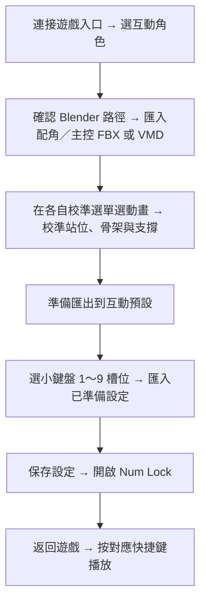

# EndfieldAnimationImporter 使用手冊

> **載入器版本備註：** 1.4.0（含）以前使用 [BEM（Better Endfield）](https://github.com/Dr-hydra/Better-Endfield) 載入；1.5.0 起使用 [EML（Endfield Mod Loader）](https://github.com/Dr-hydra/Endfield-Mod-Loader) 載入。

繁體中文 | [English](README.en.md)

適用版本：1.5.0-Alpha｜Windows x64｜2026-10-10

模組在 EML 中顯示為 **EndfieldAnimationImporter**。本版為 Alpha，使用前請閱讀相容性與限制。

## 模組介紹

本模組可將 FBX／VMD 人形動畫分別套用至主控管理員與隊伍中的配角，並在遊戲內預覽、調整站位與骨架、操作時間軸、裁切動畫片段及建立快捷鍵互動預設。主控會自動辨識目前使用的男性或女性管理員，保存預設時記錄對應主控。

單人 FBX 也可搭配測試中的管理員附加姿勢，形成雙人互動。外部模型頁另提供 EFMI 模組掃描、參數控制及需重載的網格調整。

## 1. 使用前準備

| 項目 | 說明 |
| --- | --- |
| 執行環境 | Windows x64、遊戲與可載入本模組的 EML |
| FBX／VMD 轉換 | 本機需安裝 Blender；套件沒有附 Blender |
| 動畫 JSON | 可讀取本模組產生的動畫 JSON，播放時不需要再次執行 Blender |
| 主控 | 男性管理員或女性管理員 |
| 互動角色 | 必須在隊伍中，而且遊戲已建立該角色模型 |
| 外部模型調整 | 需要另外安裝 EFMI 及對應外觀模組 |

**請停用其他第一人稱／相機模組並重啟遊戲。** 使用 EAI 自由相機時，請避免同時啟用其他相機控制模組。

本模組由 EML 載入；EFMI 請依其安裝方式另行啟動。本模組不包含 EFMI、其他作者的外觀模組或使用者的動畫檔。

### 安裝與更新

1. 關閉遊戲，透過 EML 匯入本模組 ZIP，啟用模組。
2. 停用其他第一人稱／相機模組，透過 EML 的「啟動遊戲」進入遊戲。
3. 操控管理員，進入正常可操作角色的遊戲場景。
4. 按 **Num0** 開啟互動面板。
5. 在「模組設定 → 互動角色」按「連接遊戲入口」。
6. 更新隊伍清單，選擇互動角色。

更新前可備份下方「資料保存位置」列出的資料夾。模組自身版本與 EML 版本是兩件事；本手冊不保證所有 EML／遊戲版本都相容。

## 使用懶人包



## 2. 面板與快捷鍵

面板最左邊的語言選單可切換「中文（繁體）」與「English」，立即更新介面文字。遊戲內面板與 EML 網頁各自保存語言偏好，不影響動畫 ID、骨架名稱及參數設定。

| 按鍵／頁面 | 用途 |
| --- | --- |
| Num0 | 開啟／關閉遊戲內面板 |
| Esc | 面板操作時返回遊戲 |
| 滑鼠滾輪 | 捲動面板；標題旁箭頭可收合功能區 |
| 小鍵盤 1～9 | 使用已設定的互動預設，需開啟快捷鍵與 Num Lock |
| 動畫匯入 | Blender 路徑、主控預設姿勢、主控／配角 FBX／VMD 與配角 JSON 匯入、動畫列表 |
| 模組設定 | 角色選擇、校準、時間軸、骨架參數與互動預設 |
| 自由相機 | 相機開關、快捷鍵與重設位置 |
| 外部模型調整 | EFMI 掃描與橋接控制 |

播放快捷鍵預設時，**按原鍵停止；按另一個已設定的快捷鍵，停止原動畫並切換到下一個**。空白或停用的槽位不觸發互動。角色條件不符時請依提示更換主控或隊伍角色。

EML 的模組網頁也提供設定入口。網頁的 FBX、Blender 資料夾及動畫片段另存入口會交由原生面板開啟檔案視窗；如果視窗未準備好，先回遊戲開啟 Num0 面板。

校準時可選擇其他角色導入的配角動畫；若與初始綁定角色不同，「選擇動畫」下方會出現紅字提示。若骨架異常，選定想使用的角色後重新匯入動畫。互動預設的「啟用角色動畫互用」預設關閉；勾選才可將其他角色校準的動畫設定套用到目前互動角色，身高差異會造成位置偏移。主控動畫綁定維持原規則。

## 3. 導入 FBX／VMD

匯入頁的主控操作在上、互動角色操作在下；動畫列表也分為主控與互動動畫。兩種選檔視窗分別記住上次匯入資料夾。匯入完成只加入列表，不自動播放。

首次測試建議使用正常站立的主控與互動角色，主控預設姿勢選「無」，支撐選「不固定」，方便確認原始動作。

1. 先停止目前動畫，選好要接收動畫的互動角色。
2. 進入「動畫匯入」。
3. 檢查「當前路徑」是否顯示 Blender 安裝資料夾。
4. 如果找不到，按「選擇 Blender 資料夾」，選擇含 `blender.exe` 的資料夾；也可選它的上一層 Blender Foundation 資料夾。有效位置會保存。
5. 選擇「主控預設姿勢」。
6. 按「導入配角 FBX / VMD」，選取檔案，等待狀態顯示轉換完成。轉換期間先保持角色與播放狀態不變。
7. 回到「模組設定 → 校準模式 → 配角動畫校準」選擇生成的動畫。

Blender 在背景執行，使用者不必手動操作 Blender，也不必把 FBX 交給開發者轉換。首次匯入仍需要讀取遊戲中的目標角色骨架資料。

### 主控預設姿勢

| 選項 | 效果 |
| --- | --- |
| 無 | 不添加主控動畫或附加姿勢 |
| 站立／保持站姿 | 管理員保持開始時的站姿旋轉 |
| 正面摟腰 | 管理員雙手從正面朝互動角色腰部靠近 |
| 背面摟腰 | 管理員雙手從背面朝互動角色腰部靠近 |
| 雙手摸頭 | 管理員雙手朝互動角色頭部靠近 |

附加姿勢是程序式追蹤，沒有變成來源 FBX 的雙人動作。身高、衣服、手臂長度與配角大幅移動都會影響接觸效果，仍需校準。現在可直接在「主控預設姿勢」切換並隨參數保存；選取主控動畫時使用匯入的主控動畫，不再疊加摟腰或摸頭姿勢。舊預設保留原動畫記錄的附加姿勢。

### 匯入主控動畫

1. 操控要綁定的男性或女性管理員，連接遊戲入口，選好隊伍配角並停止播放。
2. 在「動畫匯入」按「導入主控 FBX / VMD」，選取檔案。
3. 轉換完成後只加入動畫列表，不自動選取或啟動預覽；可繼續匯入其他動畫。
4. 在「模組設定 → 校準模式 → 主控動畫校準」預覽或調整主控時間軸。配角動畫在另一個選單選取。
5. 完成雙方校準後，按共用的「準備匯出到[互動預設]」，再套用小鍵盤槽位；同一預設會保存雙方動畫、主控姿勢、各自支撐及骨架參數。

主控動畫會綁定匯入時操控的男管或女管。切換性別後需選擇相符的動畫，或重新匯入；角色不符時會提示需要的管理員。主控只使用自己的匯入動畫列表，配角列表也會排除主控動畫。 主控匯入動畫可搭配配角匯入動畫；若尚未選配角匯入動畫，配角會改為站位。

### 完整動畫與角色綁定

匯入完成只更新動畫列表，不自動選取或啟動預覽；需到校準區自行選取。此版匯入時保存**完整動畫**，不自動切成多個可播放片段。舊版已產生的分段項目仍可能留在動畫列表中。

生成名稱包含來源名稱與綁定幹員名稱，有附加姿勢時也會標示姿勢。轉換結果對應該角色的骨架參考，不能只改角色名稱就可靠地套用其他幹員。要使用另一位幹員，先選該幹員，再重新匯入同一份 FBX。

在校準區預覽時，模組會嘗試自動選擇動畫對應的隊伍角色；若角色不在隊伍中，會提示應換成哪位角色。主控則檢查男管／女管綁定。

### MMD 動作（VMD）

1. 先連接遊戲入口、選擇要綁定的互動幹員並停止動畫。
2. 按「導入配角 FBX / VMD」，直接選取 `.vmd`，不需要選擇 PMX 或 MMD 模型。
3. 背景轉換完成後，使用相同的時間軸、校準與快捷鍵流程。

模組內建通用 MMD 骨架與日文骨名對應，將身體、四肢、30 個手指關節、手臂扭轉及腳／腳趾 IK 轉成所選遊戲幹員的骨架動畫。全形／半形 IK 與數字骨名會自動統一處理。鏡頭、燈光、表情、模型外觀與物理不匯入。

內建骨架的比例為通用參考，來源模型的特殊比例可能仍需校準；自訂或遊戲沒有對應的配件骨骼會列在 `conversion-report.json`，不會自動新增骨骼。純鏡頭 VMD 或沒有支援骨名的 VMD 會提示無法匯入。需要 Blender 4.2 以上；已用 Blender 5.2 驗證。

## 4. 預覽與校準

「配角動畫校準」與「主控動畫校準」可獨立收合，兩方各自操作選擇動畫、支撐、循環、播放／停止及時間軸。共用的準備匯出、另存參數設定、狀態與說明放在兩個子選單外。

兩方可同時播放；暫停、逐幀或標記區間只作用於操作的角色。有兩份匯入動畫時，停止一方會還原該方的動畫覆寫，另一方繼續；雙方均停止後還原整個站位並釋放控制。若只有一份動畫，停止會還原整個預覽。

選好匯入動畫後，即時顯示該動畫的時間軸、長度、區間起終點。已連接遊戲時會建立**第一幀暫停預覽**。未連接時仍可查看資訊，先連接後再操作播放或時間軸。

不需要「啟用校準」開關。校準區播放或操作時間軸會自動進入校準狀態，停止後還原角色。

| 控制 | 用途 |
| --- | --- |
| 播放動畫 | 啟動所選動畫預覽 |
| 停止動畫 | 停止並還原角色，保留已調整的參數 |
| 循環校準動畫 | 重複播放，避免校準到一半就結束 |
| 時間滑桿 | 定位到指定時間並暫停，角色顯示該時間的姿勢 |
| 繼續／暫停播放時間軸 | 在目前時間繼續或暫停 |
| 前一格／後一格 | 每次移動 1/30 秒 |
| 標記起點／終點 | 使用當前時間設定片段範圍，顯示一位小數 |
| 區間循環 | 反覆查看所選範圍；需要時按繼續播放 |
| 重設區間 | 將範圍改回完整動畫 |

一位小數是畫面顯示精度，逐幀時間仍以內部浮點值處理。時間軸主要適用於匯入動畫；內建測試動作不一定有同樣的片段操作。

勾選「同步主控/配角動畫」後，任一方的播放、停止、繼續／暫停、時間拖曳／逐幀及起終點標記都會同步到另一方。兩邊使用相同秒數，超過片段長度時停在結尾；取消勾選即可分開操作。播放／停止不會關閉面板，按 Num0 或 Esc 返回遊戲。

### 骨架與站位

在「骨架設定」按「更新全部骨架」，展開主控／互動角色及對應分類。可搜尋或調整實際掃描到的骨架。點擊滑桿右側數值可手動輸入數字（支援負數與小數），按「保存」套用，按「取消」放棄；輸入須在該參數範圍內。

- **人物根節點**：移動／旋轉整個模型，用於雙人站位。匯入動畫的 XYZ 以管理員參考方向表示，位移為公分，旋轉為度。X、Z 範圍為 -200～200 cm，Y 為 -100～100 cm。
- **一般骨架**：調整局部位移、旋轉與相對縮放；數值作用在動畫姿勢上，並非修改來源 FBX。
- **還原骨架預設**：清除對應角色的骨架校準；「全部還原預設」可清除整組骨架調整。

先暫停在同一幀，再調站位，比較結果較容易。開始播放時會直接定位到主控前的校準位置，不再先躺地滑行到站位。主控換地點或朝向後重新播放，會以新的主控位置重建佈置；互動角色也會跟隨主控 root Y 的佈置調整。

### 支撐模式

| 選項 | 適用情況 |
| --- | --- |
| 不固定 | 一般動作、跳躍、抬腳或需要保留原始位移的動畫 |
| 左腳固定／右腳固定 | 希望單腳作為擺動支點 |
| 左膝固定／右膝固定 | 希望跪姿以單膝附近作為支點 |

支撐只分別作用於各自角色的匯入動畫。腳部使用播放前的位置；膝部使用第一個評估姿勢的位置。膝模式不會自動把站姿變成跪姿，也不會自動找地面。先在平地啟動，再調 root Y 修正接觸高度。切換模式後，需要固定起點時停止再重播。

模式會隨參數設定與槽位保存；**不會烘焙進另存的動畫 JSON**。此版沒有雙腳固定選項。

## 5. 分段、保存與分享

1. 用時間軸找到要保留的動作開始處，按「標記起點」。
2. 找到結束處，按「標記終點」，確認長度至少 0.2 秒。
3. 使用「區間循環」檢查銜接與內容。
4. 選擇保存方式。

| 按鈕 | 保存內容 | 存放位置／用途 |
| --- | --- | --- |
| 保存動畫 | 所選動畫區間 | 輸入名稱後加入本機動畫庫；可立即在動畫列表選擇 |
| 另存動畫片段 | 所選動畫區間 | 指定外部 JSON 路徑，適合備份或分享；不額外加入動畫庫 |
| 準備匯出到[互動預設] | 當前主控、互動角色、動畫引用、骨架校準、支撐等參數快照 | 用於套用槽位或另存參數設定 |
| 另存參數設定 | 已準備的參數快照 | JSON 引用動畫 ID，**沒有包含動畫本體** |

「保存動畫」與「另存動畫片段」只在所選動畫已進入預覽時顯示；暫停預覽也可使用。調整參數、角色或動畫後，要重新準備參數快照。

### JSON 要從哪裡讀取？

- **動畫 JSON**：在「動畫匯入 → 導入動畫 JSON」讀取。本模組格式才可使用，不是任意軟體導出的 JSON。
- **參數設定 JSON**：在互動預設的目標槽位讀取，不要放進動畫匯入口。
- 分享完整互動時：提供動畫 JSON 與參數設定 JSON；接收者需先導入對應動畫，再讀取槽位設定，並使用指定管理員與幹員。

**分享時要確認動畫 ID 一致。**「另存動畫片段」會建立新的片段 ID，之前準備的參數可能仍引用原動畫。建議先另存片段，再導入這份 JSON、選擇新導入項目、完成校準並重新準備參數；分享同一份動畫 JSON 與新參數設定。另一種方式是直接複製動畫庫內被預設引用的 JSON，這會保留其 ID。

## 6. 建立快捷鍵互動預設

1. 完成動畫、站位、骨架與支撐校準。
2. 按「準備匯出到[互動預設]」。
3. 在「互動預設」選擇小鍵盤 1～9 的槽位。
4. 按「套用已準備設定」，或同列的「讀取參數設定JSON」。
5. 保存設定；小鍵盤快捷鍵預設啟用，請開啟 Num Lock。
6. 返回遊戲，按槽位對應的小鍵盤按鍵開始互動。

預設記錄男管／女管與校準時的配角。未勾選「啟用角色動畫互用」時，請選擇該預設的校準角色；勾選後可套用到目前互動角色。槽位顯示動畫名稱；如果動畫被刪除，槽位仍可能存在，但引用會顯示缺失。重新導入同 ID 動畫可更新該項目。

## 自由相機

「自由相機」頁籤在「外部模型調整」（EFMI）左邊。先手動連接遊戲入口，再使用已設定的快捷鍵啟用自由相機。預設開關快捷鍵為 **F9**，可在該頁更改並保存。WASD、E、Q、Num0 與 Esc 為保留操作，不能設成相機開關。

| 操作 | 功能 |
| --- | --- |
| WASD | 前後左右移動相機 |
| E／Q | 上升／下降 |
| 按住滑鼠右鍵拖動 | 調整方向 |
| 重設相機位置 | 回到主控角色附近 |
| 按開關快捷鍵 | 返回正常遊戲視角 |

先在自由相機頁確認快捷鍵，按 Num0 或 Esc 關閉面板，再按該鍵啟用；再按一次退出。開啟面板時相機操作暫停，失去遊戲焦點時相機自動關閉。使用前停用其他第一人稱／相機模組。

勾選「啟動相機時隱藏遊戲UI」後，啟用相機會隱藏遊戲介面，退出後還原；EAI 面板與效能資訊保留。此選項會記住上次設定。按住 Shift 可將移動速度加倍。

## 7. 外部模型調整（部分功能可用）

此區為 EFMI 外觀模組提供通用掃描與橋接，並非只針對某一對翅膀。

1. 選擇 EFMI 的 `Mods` 或其內單一模組資料夾。
2. 按「掃描模組」，展開模組、可用參數或網格。
3. 調整形態參數、支援網格的大小、角度、位移與支點。
4. 按「寫入橋接」。
5. 回遊戲按 EFMI 的重載鍵；本機常見為 F10，依面板顯示為準。

每個模組與個別網格有還原預設值入口。還原調整後仍需寫入橋接並重載。停用橋接後也需重載；EFMI 自己保存的參數值不一定跟著重設。

網格調整需按「寫入橋接」，再回遊戲按 EFMI 重載鍵（通常為 F10）套用。

掃描清單來自模組 INI、資源與描述檔，不代表目前所有項目都顯示在畫面上。EFMI 在渲染端新增的翅膀、角或衣物不一定是 Unity 骨架節點；本模組不能保證將它們當作骨架逐幀驅動。真正的 Unity Transform 部件還需對應描述與實際節點。

## 8. 資料保存位置

在 Windows 檔案總管位置列輸入：

```text
%LOCALAPPDATA%\BetterEndfield\Interaction
```

| 路徑 | 內容 |
| --- | --- |
| `ui-language.txt` | 遊戲內面板語言；網頁語言保存在瀏覽器本機儲存 |
| `overlay-settings.json` | 面板、快捷鍵槽位、骨架參數、Blender 路徑等設定 |
| `Animations\` | 本機動畫庫，每個動畫一份 JSON |
| `animation-order.json` | 動畫列表順序 |
| `SkeletonReferences\` | 掃描與轉換用骨架參考資料 |
| `FbxImports\` | FBX 轉換結果與報告，便於除錯 |
| `Exports\` | 網頁「另存參數設定」產生的設定檔；Num0 選檔另存可自行指定位置 |
| `ExternalModels\` | 使用者的外部部件描述檔（進階用途） |

使用 Num0「另存」指定的檔案存在使用者選取位置，與動畫庫是分開的。完整備份可複製上述整個 Interaction 資料夾；分享給別人時提供所需動畫與參數 JSON 即可。

## 9. 常見問題與限制

| 現象 | 處理方式 |
| --- | --- |
| 連接失敗／入口被佔用 | 停用其他相機模組，重啟遊戲；檢查 EML 模組日誌 |
| 找不到 Blender | 選擇含 blender.exe 的資料夾，確認當前路徑 |
| FBX 匯入要求停止 | 若正在播放或校準，先停止動畫再匯入 |
| 角色不符 | 使用提示指定的管理員／幹員；另一幹員需重新轉換 FBX |
| 動畫列表找不到片段 | 「另存」不會加入庫；需要導入該動畫 JSON，或改用「保存動畫」 |
| 參數設定讀取後缺少動畫 | 先導入相同 ID 的動畫 JSON，再使用參數設定 |
| 腳穿地／高度不合 | 暫停同一幀，檢查支撐模式與 root Y；此版沒有自動地形接觸修正 |
| 手或附加姿勢接觸不佳 | 先以主控預設姿勢「無」、不固定支撐測原 FBX，再調站位；附加姿勢仍為測試功能 |
| 外部網格不即時變化 | 寫入橋接並重載 EFMI；即時網格功能已移除 |

目前 FBX 入口保留 **512 MiB** 檔案檢查、來源動畫 **0.2 秒～1 小時** 與背景轉換 **5 分鐘** 逾時檢查。單個轉換後動畫 JSON 與可播放動畫沒有另設檔案大小／最大時長上限，但仍受記憶體、格式與硬體效能影響；動畫庫最多 128 個項目。

支援的來源主要為 Mixamo 與目前已處理的 Chocolate 命名人形骨架；不保證所有 FBX 骨架通用。多角色 FBX、任意命名、表情 BlendShape、頭髮／布料／道具軌道與模型 skin 匯入不在目前 FBX 動畫功能的支援範圍。網頁直接傳送 JSON 仍有通訊大小限制，大動畫建議透過 Num0 原生檔案入口讀取。

## 10. 回報問題

請附上模組與 EML 版本、主控性別、互動幹員、動畫名稱、主控預設姿勢、支撐模式、重現步驟與畫面。動畫問題請描述是原 FBX 就有，還是匯入後才發生。

本模組日誌為 DLL 旁的 `Interaction.Diagnostics.log`；FBX 的 `FbxImports` 子資料夾內另有 `result.json` 與 `conversion-report.json`。骨架／站位問題可提供暫停在同一幀的數值與畫面。
